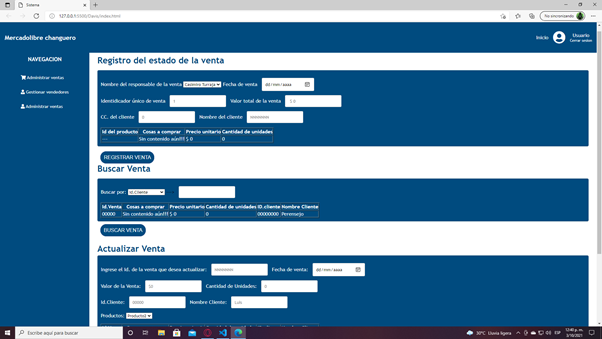

# Proyecto_grupo_04

El proyecto se basa en una aplicación de software que permita controlar las ventas físicas y virtuales de una empresa de manufactura y hacerles el correspondiente seguimiento.

# Integrantes

- Andres Camilo Parra Delgadillo
- Kevin Andres Gallardo Robles
- Luis Miguel Parra Rivillas
- German David Fajardo
- Manuel Jose Mejia Vanegas

# Imagenes del proyecto
**Imagen Modulo Ingreso/Registro**  
  

**Imagen Modulo Gestion de Usuarios**  
  
 
 
 **Imagen Modulo Administracion de Ventas**  
   
 
   
 
 
 
 **Imagen Modulo Administrador de Productos**  
   
 
